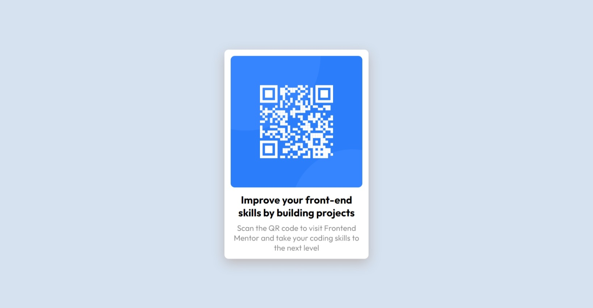

# Frontend Mentor - QR code component

## 1. Overview

The challenge is to build out this QR code component and get it looking as close to the design as possible.


### a) My screenshot



### b) Links

- Solution URL: [Add solution URL here](https://github.com/hieutrantrong21520859MMCL21/FrontEndPractice_Intern_QRCodeComponent)
- Live Site URL: [Add live site URL here](https://hieutrantrong21520859mmcl21.github.io/FrontEndPractice_Intern_QRCodeComponent/)

## 2. My process

### a) Built with

- Semantic HTML5 markup
- CSS custom properties
- [Styled Components](https://styled-components.com/) - For styles

### b) What I learned

- How to custom the page with CSS selector references.
- How to add Google fonts to the project.
- Some codes I am most proud of (which consist of knowledge I have learned):

```css
.container {
      width: 250px;
      height: 400px;
      background-color: hsl(0, 0%, 100%);
      box-shadow: 0px 10px 30px 0px #bdb8b8;
      padding: 15px;
      border-radius: 10px;
      margin: auto;
      position: absolute;
      top: 0;
      bottom: 0;
      left: 0;
      right: 0;
}
```
```css
.bold-text {
      font-family: 'Outfit', sans-serif;
      font-weight: 700;
      font-style: normal;
      text-align: center;
      font-size: 20px;
      margin-top: 10px;
}
```

### c) Useful resources

- [MDN - HTML](https://developer.mozilla.org/en-US/docs/Web/HTML): this helped me a lot about HTML via articles.
- [Learn HTML](https://web.dev/learn/html): this is an amazing website that provides lessons about HTML with examples.
- [MDN - CSS](https://developer.mozilla.org/en-US/docs/Web/CSS): this helped me well with CSS via articles.
- [Learn CSS](https://web.dev/learn/css): this is an amazing website that provides lessons about CSS with examples.